# Title
Aaron Jeung

#### Question
Are some airports more delay-prone and cause delays that propagate to later flights in the day? 

#### Hypothesis
Small airports should have a low rate of delays because there is less traffic at the airport. 
Large airports should have a low rate of delays because airlines use it as a hub, so airlines should be able to use their spare airplanes to better prevent delays. 
Therefore, I hypothesize mid-size airports to have the highest rate of delays.  

#### Dataset
I used flight data from the Department of Transportation's Bureau of Transportation Statistics. This dataset only contains US domestic flights. I particularly looked
at January 2023-November 2025 data, to exclude potential COVID anomalies. 
The dataset can be found here: https://www.transtats.bts.gov/Tables.asp?QO_VQ=EFD&QO_anzr=Nv4yv0r%FDb0-gvzr%FDcr4s14zn0pr%FDQn6n&QO_fu146_anzr=b0-gvzr

#### Results
I first looked at whether there was a correlation between airport size and how frequent delays occurred. Delays are defined as a flight departing >15 minutes after schedule. 

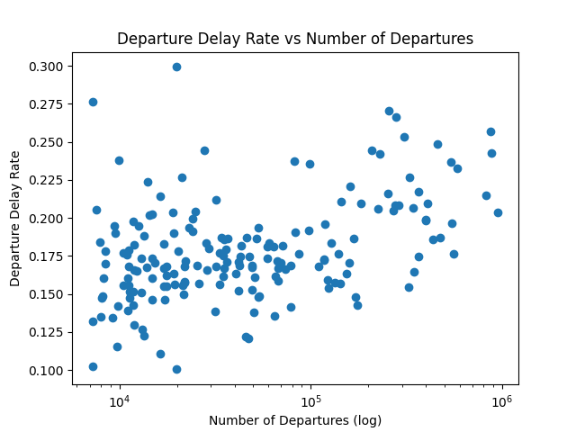

There appears to be a U-shaped trend, which means that both airports with lots of flights and few flights tend to have a higher rate of delayed departures. 

However, it is too early to conclude large airports are causing delays. During my analysis, I found that 53% of airplanes that arrive late also depart late for its next flight,
while 12% of airplanes that arrive on time depart late for its next flight. This means that it is almost 5 times more likely that a delay is due to the airplane arriving late from
its previous flight instead of some other cause

For the next part of my analysis, I looked at which airports are causing delays (which lead to further delays throughout the day). I called instances of an airplane arriving on time
but its next flight being delayed as sourceDelays, and analyzed which airports had the highest rate of sourceDelays. As an example, a sourceDelay rate of 0.15 means 15% of flights
that arrived on time at an airport departed late on its subsequent flight.

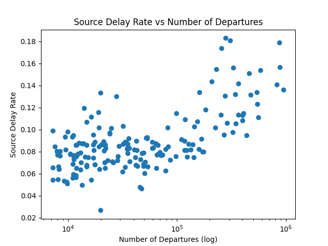

From this graph, we can see that airports with more flights tend to be causing more delays than airports with fewer flights. 

I also looked at which airports correct delays. I called instances of an airplane arriving late but its next flight departing on time as correctDelays, and analyzed which airports
had the highest rate of correctDelays. As an example, a correctDelay rate of 0.15 means 15% of flights that arrived late at an airport departed on time on its subsequent flight.

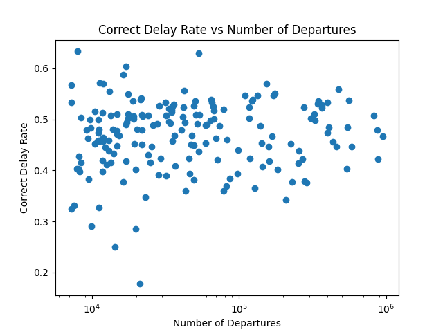

There doesn't seem to be any correlation between how busy an airport is and how well it can recover from delays. 

I decided to also look at these rates per airline as well. Not all airlines fly equally out of each airport, so "big airports" and "small airports" can vary between each airline network. 
I specifically looked at Southwest, Delta, and American, which were the 3 biggest airlines in the dataset.  

| Southwest | Delta | American |
| :---: | :---: | :---: |
| 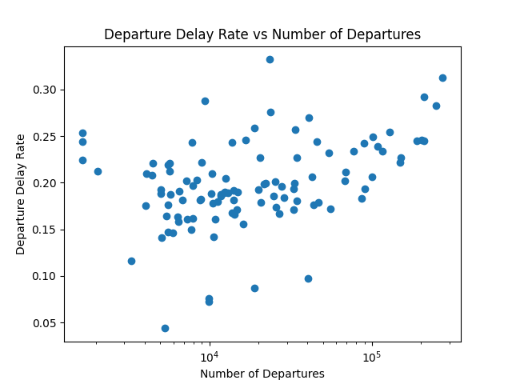 | 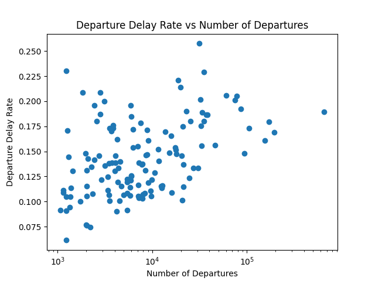 | 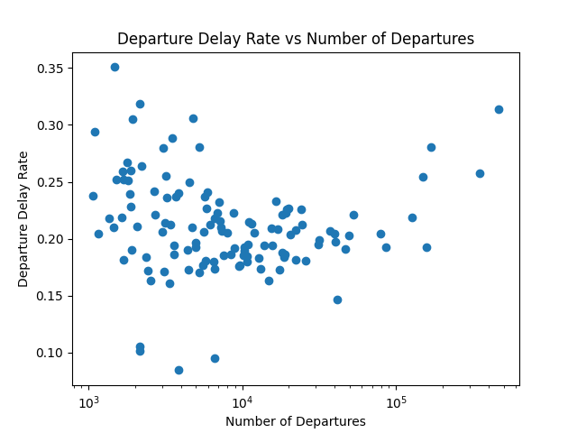 |

Big and small airports within the network generally have the highest rates of delays, while mid-size airports generally have the lowest rates of delays. 

| Southwest | Delta | American |
| :---: | :---: | :---: |
| 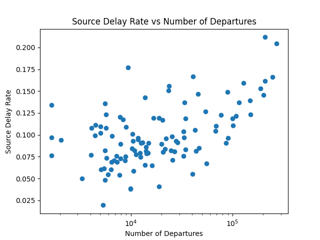 | 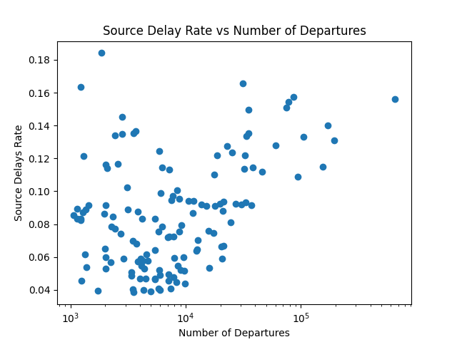 | 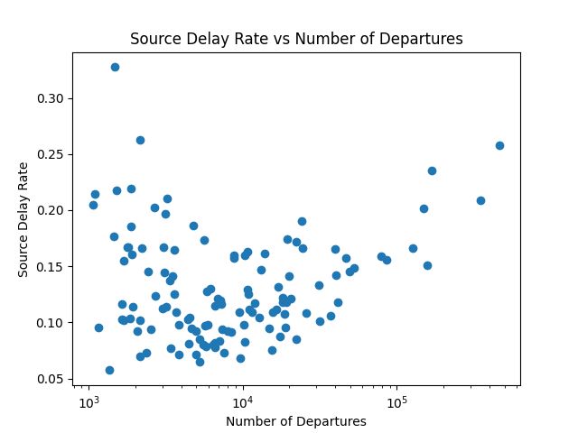 |

For Southwest, larger airports caused more delays than smaller airports, but for Delta and American, both large and small airports had a higher rate of causing delays than mid-size airports. 

| Southwest | Delta | American |
| :---: | :---: | :---: |
| 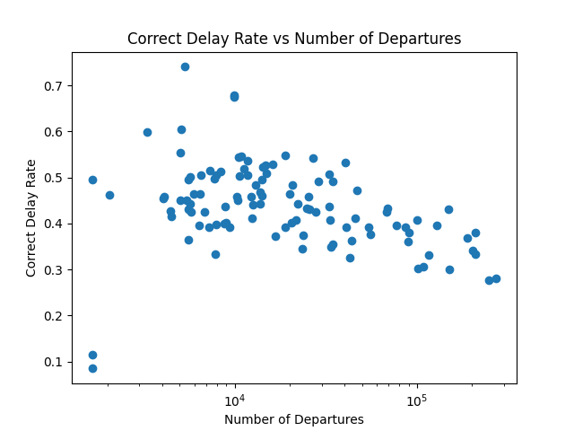 | 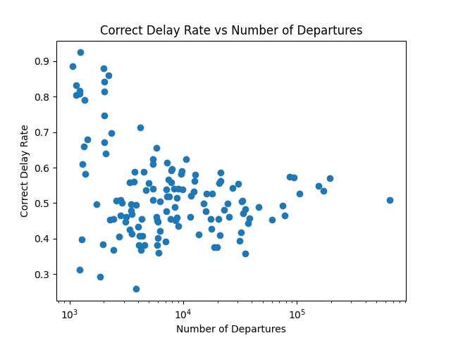 | 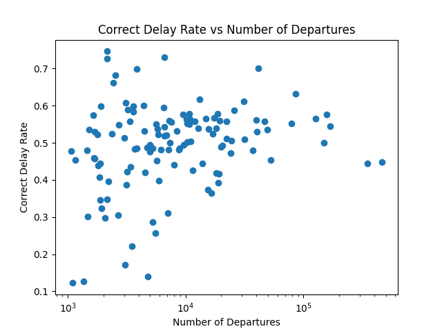 |

For Southwest, larger airports tend to be worse at recovering from delays, while for American and Delta, there is not much of a correlation between how well an airport can recover from delays and the size. 

#### Conclusion

While there are variances between airline networks, larger airports with more flights are causing delays more frequently shown by the sourceDelay graphs, and are not really any better at recovering from delays shown by the correctDelay graphs, so my hypothesis was not supported. 

Interestingly, Delta and American both have similar trends when it comes to sourceDelay and correctDelay rates, and Southwest is the odd one out. Delta and American are full-service carriers that operate on a hub-and-spoke model (travelers mainly transfer at hub airports) while Southwest is considered to be a low-cost carrier that operates more of a point-to-point model (directly connecting cities). More research is needed if this is causing discrepeacies. 
